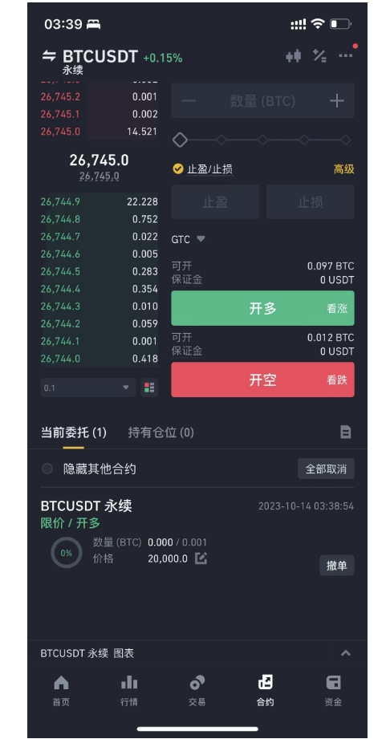

# 币安跟单助手 (Binance Copytrading Assistant)

#### 技术支持：懒人交易策略研发团队
#### 币安带单: 懒人交易
#### twitter: @lazyer_trading
#### telegram: https://t.me/bn_ct_track
#### email: lazyer.trading@gmail.com

## 1. 软件介绍 (Introduction)
#### 全球最大加密货币交易所币安上线 "跟单交易" 功能后再度掀起跟单交易热潮，吸引不少顶尖交易员入驻，对于很多满员团队很多投资者也出现上车难的遗憾。对此，懒人团队采用网页追踪技术24小时监测交易员交易信息并同步到用户的合约账户，软件具体功能如下：
#### (1) 不依赖币安跟单系统，24h追踪交易员交易信息，并可同步到合约账户进行跟单
#### (2) 省去10%带单员佣金，追踪 开仓/平仓/加仓/减仓操作 同时支持邮件通知
#### 1.0 版本目前免费公测中，欢迎点赞转发并提出您宝贵意见
#### 视频教程：制作中

## 2. 软件下载 （Download）

windows 版本: https://github.com/lazyer-trading/Binance_CopyTrading_Assistant/releases/download/v1.0/win_v1.0.zip

linux 版本: https://github.com/lazyer-trading/Binance_CopyTrading_Assistant/releases/download/v1.0/linux_v1.0.zip

(linux中若无法运行，请按照sh文件命令安装好chrome驱动)

## 3. 使用教程 （Usage）

##### 准备工作
    1. 科学上网工具，确保访问binance
    2. 准备 binance api，勾选允许读取，允许合约(futures)，（一切api操作均在本地运行，远程不会访问！！）
    3. binance合约设置中，设置双向持仓模式，这样可以跟随不同头寸

### 步骤1：用户跟单设置
跟单设置主要是修改 track.yaml 文件, 软件说明如图中标注

跟单员主页网址如下：

修改完记得保存

### 步骤2：运行
 windows: ./track.exe

 linux: ./track
 
 windows 运行结果如下：
 

### 步骤3：手机端控制暂停/继续

    PC上软件启动后，在户外的话，我们可以通过手机下达合约 “信号单” 来控制中止/和继续。 本软件设置信号单子为 
    
    <"BTCUSDT",限价，无法立即成交价格，数额=0.001>
    
    其中空单为暂停运行，多单重启运行。软件会识别信号单并立即取消该订单，注意信号单

#### 例如：软件中止信号单

#### 例如：软件继续信号单

## 4. 加入我们 （Join us）

欢迎行情技术分析，区块链开发，python/selenium/机器学习/量化交易等相关朋友加入我们，详情请联系上方邮箱。
