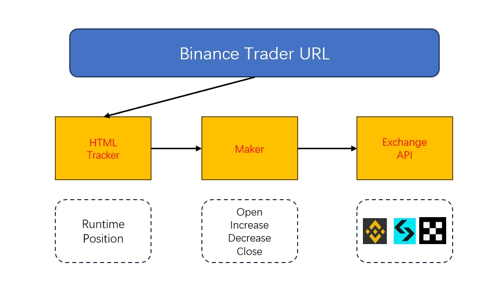

# 币安跟单助手 (Binance Copytrading Assistant)

#### 技术支持：懒人交易策略研发团队
#### 币安带单: 懒人交易
#### twitter: @lazyer_trading
#### telegram: [@lazyer_trading](https://t.me/bn_ct_track)
#### email: lazyer.trading@gmail.com
#### 欢迎加入Bitget节点计划：https://partner.bitget.fit/bg/1KPPQ8 注册交易返还50%交易手续费
#### bitget跨平台跟单/带单助手：https://github.com/lazyer-trading/bitget_copytrading_assistant
### **github帮忙star后可联系我们开通一个月测试账号**

## 1. 软件介绍 (Introduction)
#### 全球最大加密货币交易所币安上线 "跟单交易" 功能后再度掀起跟单交易热潮，吸引不少顶尖交易员入驻，对于很多满员团队很多投资者也出现上车难的遗憾。对此，懒人团队采用网页追踪技术24小时监测交易员交易信息并同步到用户的合约账户，软件具体功能如下：
#### (1) 不依赖币安跟单系统，24h追踪交易员交易信息，并可同步到合约账户进行跟单
#### (2) 省去10%带单员佣金，追踪 开仓/平仓/加仓/减仓操作 同时支持邮件通知
#### 视频教程：https://www.youtube.com/watch?v=w5KFpZRVP8c
#### 建议使用linux云服务器后台长期运行，轻量级机器租用（5u/月）可以参考腾讯云（不要购买大陆和美国区域，访问不了币安！）：https://cloud.tencent.com/product/lighthouse

## 2. 软件下载 （Download）

下载地址：https://github.com/lazyer-trading/Binance_CopyTrading_Assistant/releases

(linux中若无法运行，请按照sh文件命令安装好chrome驱动, 若存在权限问题在当前路径输入 "chmod 777 -R *")

## 3. 实现原理 （Diagram）
#### 3.1 信号追踪和下单

#### 3.2 同风险定比跟单
#####     根据带单员资产定比跟随，风险与带单员同步，可设置cp_ratio 参数进行风险缩放，例如：
#####     trader: balance = 1000 usdt,   position(ETHUSDT) = [value:2000u, leverage:10x, margin:200u, risk_rate:2 ]
#####     user: balance = 100 usdt,   position(ETHUSDT) = [value:200u, leverage:50x, margin:4u, risk_rate:2 ] if cp_ratio = 1.0
#####     user: balance = 100 usdt,   position(ETHUSDT) = [value:300u, leverage:50x, margin:6u, risk_rate:3 ] if cp_ratio = 1.5

## 4. 使用教程 （Usage）

##### 准备工作
    1. 科学上网工具，确保访问binance
    2. 准备 exchange api，（一切api操作均在本地运行，远程不会访问！！）
    3. 合约设置中，设置双向持仓模式，这样可以跟随不同头寸

### 步骤1：用户跟单设置
跟单设置主要是修改 setting.yaml 文件, 软件说明如图中标注

跟单员主页网址如下：

修改完记得保存

### 步骤2：运行
 windows: ./main.exe

 linux: ./main
 
追踪结果如下：
 
同步跟单如下：

## 5. 加入我们 （Join us）

欢迎行情技术分析，区块链开发，python/selenium/机器学习/量化交易等相关朋友加入我们，详情请联系上方邮箱。
